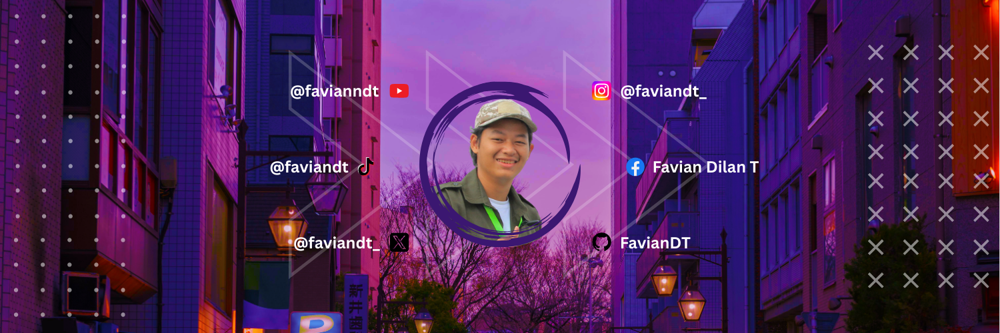

## 💫 About Me:

I am currently a bachelor's degree student at Nusantara Islamic University, majoring in Informatics Engineering. 

## 🌐 Socials:

      

# 💻 Tech Stack:

                             

# 📊 GitHub Stats:

 
 

## 🏆 GitHub Trophies

### ✍️ Random Dev Quote

### 🔝 Top Contributed Repo

---

## 💰 You can help me by Donating

